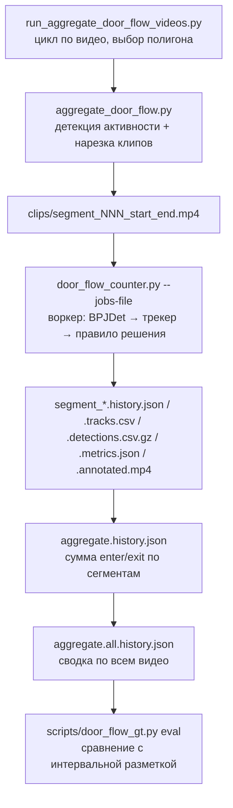

# Архитектура: подсчёт количества вошедших людей (door flow)

Документ описывает конвейер, который по видео с камеры над дверью автобуса определяет количество
вошедших (и вышедших) пассажиров. Основано на текущем состоянии кода в корне репозитория
(`door_flow_counter.py`, schema `door-flow-observability/v3`).

---

## 1. Постановка задачи и особенности входных данных

- Вход: видео `mp4_out/<N>.mp4` (N = 1..13 и 27..53), 352×288 px, 25 fps, камера установлена над
  дверью и смотрит вниз-внутрь салона.
- Две геометрии камеры:
  - **layout 1 (видео 1–13)** — дверь сверху-по-центру кадра, пассажиры идут к валидатору вниз-вправо;
    полигон `dataset/door_polygons/2.json` используется для всех этих видео.
  - **layout 27 (видео 27–48)** — дверь занимает почти весь кадр (`half_lane` ≈ 142 px ≈ вся ширина);
    полигон `dataset/door_polygons/27.json`.
- Особенности: люди вблизи камеры занимают всю высоту кадра, bbox прижимается к верхней/нижней
  границе (координаты «насыщаются»), плотные очереди с сильными перекрытиями, стоящие у валидатора
  пассажиры, долгие пустые интервалы (у видео 27–48 в основном 0–2 входа за всё видео).
- Ground truth по видео целиком: `notes.txt/count_people.txt` (например 1→66, 2→41, 4→51, 13→68).
  Интервальная разметка «сколько реально вошло в каждом активном отрезке»:
  `notes.txt/door_flow_gt/{1,2,4,6,10,12,13,30}.txt`.

---

## 2. Общая схема конвейера



Три уровня:

| Уровень | Скрипт | Роль |
|---|---|---|
| Пакет видео | `run_aggregate_door_flow_videos.py` | Последовательно запускает агрегатор для каждого видео, подбирает полигон (`--door-polygon 2.json`, `--alt-door-polygon 27.json` для `--alt-video-indices 27..48`), пишет `mp4_out/door_flow_runs/aggregate.all.history.json`. |
| Одно видео | `aggregate_door_flow.py` | Находит интервалы активности, режет клипы, распределяет их по воркерам/GPU, суммирует счётчики → `aggregate.history.json`. |
| Один клип | `door_flow_counter.py` | Детекция людей, трекинг, решение enter/exit для каждого трека, дедупликация, артефакты наблюдаемости. |

`run_all_aggregates.sh` запускает door-flow и ksiva пакеты подряд.

---

## 3. Детекция активности и нарезка (`aggregate_door_flow.py`)

Цель — не прогонять детектор по длинным пустым участкам.

1. `activity_scores()`: кадр уменьшается до `--resize-width 320 × --resize-height 240`, переводится в
   grayscale и сравнивается с кадром, снятым `--diff-seconds 5.0` с назад. Считается число пикселей с
   разницей > `--pixel-threshold 25`.
2. `activity_intervals()`: пики через `scipy.signal.find_peaks(height=--peak-height 15000,
   distance=--peak-distance-frames 25)`; интервал вокруг пика расширяется, пока сигнал не упадёт ниже
   `--noise-threshold 5000`; к границам добавляется `--context-seconds 3.0`; интервалы с зазором
   ≤ `--merge-gap-seconds 2.0` сливаются.
3. `write_clip()`: каждый интервал → `clips/segment_{idx:03d}_{start:.2f}_{end:.2f}.mp4` (OpenCV, `mp4v`,
   исходные fps/размер).
4. Планирование: задания сортируются по длительности (длинные первыми) и раскладываются по
   `--workers` потокам / `--devices`; каждому воркеру передаётся JSON-манифест через
   `door_flow_counter.py --jobs-file`, чтобы модель загружалась один раз на процесс.
5. Мониторинг VRAM через `nvidia-smi` до/после воркера; в `aggregate.history.json` пишется блок `vram`
   (`peak_used_mb`, `worker_delta_mb`, `estimated_two_workers_mb`, `two_workers_fit`).

Формат `aggregate.history.json` (на видео): `video`, `door_polygon`, `fps`, `counts{enter,exit}`,
`intervals[]`, `segments[]` (index, start/end, clip, annotated video, history, counts, events, vram).

---

## 4. Счётчик одного клипа (`door_flow_counter.py`)

### 4.1 Детектор — BPJDet

- `third_party/BPJDet` (Body-Part Joint Detector, YOLOv5-семейство): одновременно даёт bbox тела и
  ассоциированную точку головы/лица.
- Веса: `models/bpjdet/ch_face_s_1536_e150_best_mMR.pt` (small; large-вариант испытан и отклонён).
- Параметры: `--img-size 640`, `--batch-size 1` (в пакетных прогонах используется 4), `--confidence 0.20`,
  `--iou 0.75` (NMS), `--match-iou 0.6` (связка тело–лицо), `--device` (авто → `cuda:0`).
- Выход на кадр: `boxes [(x1,y1,x2,y2)]`, `scores`, `heads [[x,y]|None]`. **Точка головы не
  обрезается границами кадра** — это важно для близких людей, чей bbox прижат к краю.
- Класс `InferenceRuntime` держит модель (и опционально TransReID) в памяти между заданиями.

### 4.2 Геометрия двери — `DoorGeometry`

Полигон `dataset/door_polygons/<stem>.json`:

```json
{
  "frame_size": {"width": 352, "height": 288},
  "points": [[106,2],[271,0],[240,166],[113,175]],
  "point_order": ["top_left","top_right","bottom_right","bottom_left"],
  "zone": {"outside_progress": 110, "inside_progress": 128,
           "head_outside_x": 250, "head_inside_x": 320, "head_outside_max_y": 40}
}
```

- Верхнее ребро = улица (outside), нижнее = салон.
- `coordinates(point) → (progress, lateral)`: `progress` — проекция на ось «верх→низ» двери (0 у
  верхнего ребра, растёт к салону), `lateral` — смещение от оси.
- `in_lane()` — точка в коридоре ±`half_lane` (`--lane-margin 35` px) с запасом `--completion-margin 18`;
  `contains()` — строго внутри полигона (`cv2.pointPolygonTest`);
  `region()` → `outside | door_outside | door_salon | salon | other`.
- Блок `zone` — **покамерная калибровка** порогов правила решения (см. 4.4); CLI-аргументы
  `--zone-outside-progress`, `--zone-inside-progress`, `--head-*` переопределяют JSON;
  `resolve_zone_parameters()` выбирает: CLI → JSON → встроенные 110/128, head-путь выключен.
  Для `27.json`: `outside_progress 95`, `inside_progress 128`, head-путь выключен.
- Разметка полигона: `scripts/mark_bus_door_polygon.py`.

### 4.3 Трекеры (`--tracker`)

**`bytetrack` (по умолчанию) — класс `MotionTracker`**
- Обёртка над `boxmot.trackers.bytetrack.bytetrack.ByteTrack`, только движение (Kalman + IoU), без ReID
  и без слияния дубликатов.
- `--bytetrack-track-thresh 0.3`, `--bytetrack-match-thresh 0.8`, `--bytetrack-track-buffer 25`.
- Наблюдения трека берутся из **Kalman-сглаженных боксов** (`MotionTracker.smoothed_boxes`), а не из
  сырых детекций — сырые боксы удваивали FP.
- TransReID не загружается → ~85 fps на RTX 3050, ~1 ГБ VRAM.

**`appearance` (legacy) — класс `AppearanceTracker`**
- ReID-эмбеддинги TransReID (`TransReIDExtractor`, `models/transreid_occ_duke_vit_stride.pth`,
  конфиг `OCC_Duke/vit_transreid_stride.yml`) + геометрия.
- Сопоставление: `--reid-distance 0.40`, запасной `--match-center-distance 40`, окно реконнекта
  `--appearance-max-missing 15`, скользящее окно эмбеддингов `--appearance-sample-count 5`,
  окончательное истечение `--tracker-max-missing 45`, геометрический реконнект у двери
  `--reconnect-iou 0.25` / `--reconnect-bottom-distance 100`.
- `merge_active_duplicates()`: две одновременно активные дорожки с IoU ≥ `--duplicate-merge-iou 0.35`,
  ReID ≤ `--duplicate-merge-reid-distance 0.20`, ≥ `--duplicate-merge-min-frames 2` кадров сливаются;
  выживает меньший ID, поглощённый пишется в `aliases[absorbed] = survivor`.

### 4.4 Правила решения (`--decision-rule`)

**`zone` (по умолчанию) — `evaluate_track_zone()`** — гистерезис по оси двери:

1. Основной путь: для каждого наблюдения с `|lateral| ≤ half_lane`:
   `progress ≤ outside_progress` → состояние `out`; затем `progress ≥ inside_progress` при состоянии
   `out` → **enter**. Обратный переход in→out запоминается как кандидат на exit.
2. Второй путь (только если `head_outside_x > 0`, т.е. layout 1): точка головы с `x ≤ 250 и y ≤ 40`
   («у двери»), затем `x ≥ 320` («сторона салона») → **enter**. Нужен для близких людей, у которых
   центр тела зафиксирован около y≈144 и основной путь его не видит.
3. Enter имеет приоритет над более ранним exit; exit засчитывается только если enter не найден.
4. Предикаты: `minimum_observations` (`--min-observations 3`) и `zone_crossed_inward`.

**`progress` (legacy) — `evaluate_track()`** — предикаты по чистому смещению начала→конца трека:
`was_inside_door_or_lane` (строго в полигоне или в коридоре при
`net_progress ≥ --lane-fallback-progress-multiplier 2.5 × --min-progress 20`),
`start_not_salon`, `finished_beyond_or_near_salon_edge` (`--entry-boundary-distance 50`),
`center_progress_sufficient`, `bottom_progress_sufficient`,
`salon_start_has_strong_depth_evidence` (`--salon-start-min-bottom-center-ratio 2.0`).
Работало только потому, что кастомный трекер фрагментировал треки: полный трек «дверь → под камерой»
даёт ~0 или отрицательный net progress (бокс сжимается).

Решения принимаются дважды: онлайн (при истечении трека, `online_decision`) и финально по полному
списку наблюдений (`final_decision`), различия фиксируются в `reconciliation`.

### 4.5 Дедупликация по каноническим группам

- `canonical_track_id()` сворачивает цепочки `aliases` к корневому ID.
- `canonical_deduplicated_counts()`: для группы фрагментов одного канонического ID с **конфликтующими**
  решениями (есть и enter, и exit) засчитывается максимум 1 enter + 1 exit; единодушные группы не
  сворачиваются (иначе недосчитываются реальные очереди похожих людей — видео 4: 51 → 29).
- В `reconciliation` сохраняются `legacy_counts` (сумма по всем ID), `canonical_counts` (строгий
  диагностический вариант), `canonical_groups[]`, счётчики `duplicate_group_count`, `conflict_group_count`.
- Для ByteTrack aliases нет, дедупликация фактически не срабатывает.

### 4.6 Выходные артефакты одного сегмента

| Файл | Содержимое |
|---|---|
| `*.history.json` | `schema_version`, `config`, `video_metadata`, **`counts{enter,exit}`**, `events{track_id: enter/exit}`, `aliases`, `tracks{id: [{frame,bbox,center,head}]}`, `online_counts/online_events`, `track_evaluations` (предикаты, метрики, `reason_codes`), `alias_details`, `reconciliation`, `outputs`. |
| `*.detections.csv.gz` | Каждая детекция: `frame, time_seconds, score, bbox_*, center_*, bottom_*, head_x/y, *_progress/lateral/region, inside_door, assigned_track_id, canonical_track_id, assignment_method, appearance_distance, …` |
| `*.track_events.csv.gz` | События трекера: `created, matched, missed, expired, merged, merge_candidate, reconnected, online_decision, final_decision, run_error`. |
| `*.tracks.csv` | Строка на трек: жизненный цикл, start/end region & progress, net_progress, флаги предикатов, `enter_predicates_json`, `predicate_metrics_json`. |
| `*.metrics.json` | Тайминги по стадиям (`decode_preprocess, transfer, bpjdet, nms, postprocess, reid, tracker, count_draw_write`), throughput, снимки RSS/CUDA-памяти. |
| `*.annotated.mp4` | Полигон (magenta), надпись `Entered/Exited`, боксы с ID и решением. |

При ошибке `persist_partial_artifacts()` сохраняет частичные данные со `status != success`.

Структура каталога: `mp4_out/door_flow_runs/<N>/{aggregate.history.json, clips/, segment_*.…}` и
общий `mp4_out/door_flow_runs/aggregate.all.history.json`.

---

## 5. Разметка и оценка качества

- `scripts/door_flow_gt.py template <N…>` — генерирует `notes.txt/door_flow_gt/<N>.txt` со строкой на
  сегмент (`start-end = N  # seg k … model=M`); `eval <N…> --event enter` — сопоставляет события модели
  интервалам (по максимальному перекрытию окна трека, иначе ближайший в пределах `--tolerance 2.0` с)
  и печатает truth/model/FP≥/FN≥ по интервалам и итог.
- `scripts/door_flow_calibrate.py` — офлайн-пересчёт сохранённых треков с другими порогами без
  повторной детекции.
- `scripts/door_flow_retrack.py`, `door_flow_retrack2.py` — перетрекинг кэшированных
  `detections.csv.gz` через boxmot (ByteTrack/OcSort); `door_flow_zone_sweep.py`,
  `door_flow_head_sweep.py`, `door_flow_fn_sweep.py`, `door_flow_multipass_sweep.py`,
  `door_flow_episode_sweep.py` — перебор порогов; `sum_door_flow_enters.py` — сумма по прогонам.

### Текущие результаты (`mp4_out/door_flow_runs`, ByteTrack + zone + head, img 640)

Всего по 35 видео: модель 495 enter vs GT 505.

| Видео | GT | Модель | Видео | GT | Модель |
|---|---|---|---|---|---|
| 1 | 66 | 41 | 8 | 41 | 36 |
| 2 | 41 | 41 | 9 | 42 | 47 |
| 3 | 22 | 27 | 10 | 51 | 55 |
| 4 | 51 | 44 | 11 | 6 | 9 |
| 5 | 46 | 48 | 12 | 9 | 5 |
| 6 | 55 | 53 | 13 | 68 | 64 |
| 7 | 1 | 4 | 27–48 | 0–2 | 0–4 |

По интервальной разметке (8 видео, truth 344): legacy progress-правило 369 (FP≥81, FN≥56);
zone-only 256 (FP22, FN110); **zone+head 312 (FP36, FN68)**. Разбиение по плотности: legacy хуже на
редких сегментах (FP), ByteTrack — на плотных (FN).

---

## 6. Ключевые особенности и принятые решения

1. **Активностная нарезка** — детектор работает только на движущихся участках; кадр целиком
   сравнивается с кадром 5 с назад, а не с соседним, чтобы медленно идущие люди давали сигнал.
2. **Точка головы из BPJDet** как второй сигнал пересечения — единственный неклампируемый признак для
   крупных фигур у камеры.
3. **Kalman-сглаженные боксы** вместо сырых детекций для правила решения.
4. **Гистерезис по двум порогам (out ≤ a, in ≥ b)** вместо net-progress: устойчив к дрожанию бокса, но
   требует, чтобы человек был замечен «снаружи» хотя бы раз.
5. **Покамерная калибровка порогов в JSON полигона** — иначе стоящие в дверях пассажиры layout 27
   давали десятки ложных входов (видео 40: 21 при GT 0).
6. **Приоритет enter над exit** — варианты «первое пересечение»/«чистое пересечение» теряли реальные
   входы и порождали 20–30 фантомных выходов от дрейфа ID.
7. **Двойное решение (online + final) и полный аудит** — каждая детекция, событие трекера и предикат
   логируются, что позволяет калибровать офлайн без повторного прогона GPU.
8. **Отказ от более высокого разрешения** (`img_size 960`) и длинного окна ReID (30) — больше шумных
   фрагментов, результат хуже.

---

## 7. Известные ограничения

- **Пропуски в плотных очередях (видео 1: 41/66, FP 0)** — человек никогда не наблюдается «снаружи»
  (перекрыт идущим впереди, статичная детекция у валидатора работает как «сток» ID). Ни один из
  офлайн-приёмов (подавление статичных детекций, multi-pass, буст крупных низкоуверенных боксов,
  переборы `track_thresh/match_thresh/track_buffer`) не дал выигрыша без роста FP.
- **Выходы (exit) не калиброваны** — нет GT по выходам; счётчик `exit` шумный (например 33: 12 при
  пустом автобусе).
- **Дубли между сегментами** — каждый сегмент обрабатывается новым процессом трекера; человек, стоящий
  у двери через несколько несмежных сегментов, засчитывается в каждом.
- **Разделение «один фрагментированный человек» vs «несколько похожих людей»** по статистике треков не
  решается; нужна разметка по событиям (таймстемпы) или трекер с учётом перекрытий.
- **Гибрид legacy/ByteTrack по плотности** (k=8) даёт лишь небольшой выигрыш ценой 3× вычислений — не
  внедрён.
- **Разные копии кода**: `upload/door_flow/*` — более старая схема v2 (без предиката
  `salon_start_min_bottom_center_ratio`), не путать с корневой v3.
- `door-flow-batching-architecture.md` описывает **не реализованный** план общего GPU-воркера с
  микробатчами из нескольких видео (`DoorFlowSession`, `GPUInferenceWorker`, `BatchScheduler`).

---

## 8. Зависимости и окружение

- Python: `torch`, `torchvision`, `opencv-python`, `numpy`, `scipy`, `pandas`, `boxmot`, `torchreid`
  (см. `requirements.txt`); `third_party/BPJDet`, `third_party/TransReID`.
- GPU: одна RTX 3050 4 ГБ; при нехватке VRAM использовать `--batch-size 1`.
- Модели: `models/bpjdet/ch_face_s_1536_e150_best_mMR.pt` (основная), `ch_face_l_*` (не используется),
  `models/transreid_occ_duke_vit_stride.pth` (только для `--tracker appearance`).

### Типовые команды

```bash
# одно видео целиком
python door_flow_counter.py --video mp4_out/2.mp4 --device 0

# одно видео с нарезкой по активности
python aggregate_door_flow.py --video mp4_out/2.mp4 --devices 0 --workers 1 --batch-size 4

# пакет всех видео
python run_aggregate_door_flow_videos.py --devices 0 --workers 1

# оценка по интервальной разметке
python scripts/door_flow_gt.py eval 2 4 10 12 30 --event enter --verbose

# legacy-режим
python door_flow_counter.py --video mp4_out/2.mp4 --tracker appearance --decision-rule progress
```
