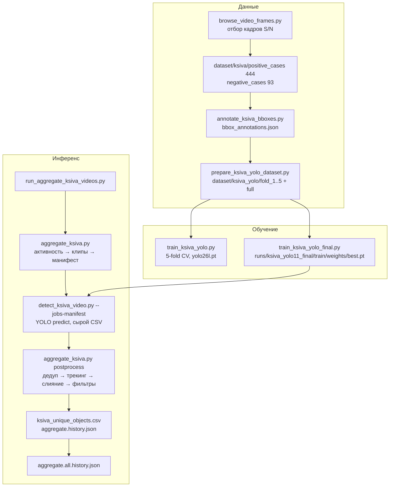
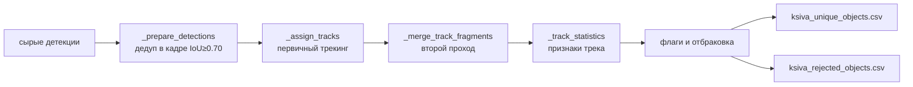

# Архитектура: детекция ксив (проездных документов) на кадрах

Документ описывает конвейер, который находит на видео моменты предъявления «ксивы» (документа,
показываемого водителю/валидатору) и считает число уникальных предъявлений на видео. Основано на
`detect_ksiva_video.py`, `aggregate_ksiva.py` (schema_version 5), `run_aggregate_ksiva_videos.py` и
скриптах подготовки датасета/обучения.

---

## 1. Постановка задачи

- Вход: те же видео `mp4_out/<N>.mp4` (352×288, 25 fps), что и для подсчёта людей.
- Нужно: число **уникальных предъявлений** ксивы на видео (а не число кадров с ксивой).
- Ground truth по видео: второе число в `notes.txt/count_people.txt` («ксива N»), например
  1→7, 2→6, 6→23, 8→26, 13→31, видео 27–48 → 0–1.
- Сложности: объект маленький и низкоконтрастный, показывается на 0.5–2 с, часто у верхнего/левого
  края кадра; статичные фоновые объекты (наклейки, таблички) похожи на документ и дают устойчивые
  ложные детекции; один показ может разбиваться на несколько фрагментов из-за перекрытий рукой.

---

## 2. Общая схема



---

## 3. Сбор данных и разметка

### 3.1 Отбор кадров — `browse_video_frames.py`
- Интерактивный просмотр видео (`--video`, `--step 10`): стрелки/A-D — кадр, J/L — прыжок на `step`,
  Space — автоплей, **S** — сохранить кадр, **N** — пометить кадр без объекта.
- Кадры сохраняются с последовательными именами `0000001.jpg` в `--output-dir`
  (по умолчанию `dataset/ksiva/negative_cases`).

### 3.2 Разметка bbox — `annotate_ksiva_bboxes.py`
- Мышью рисуется один прямоугольник на изображение; **S** — сохранить, **N** — «нет объекта»,
  **A/D** — навигация, **F** — fullscreen; возобновляет работу с первого неразмеченного файла.
- Результат `dataset/ksiva/bbox_annotations.json`:

```json
{
  "format_version": 1,
  "annotations": {
    "positive_cases/0000012.jpg": {"case": "positive_cases",
        "image_size": {"width": 352, "height": 288},
        "bbox": [x1, y1, x2, y2], "annotated_at": "…"},
    "negative_cases/0000003.jpg": {"case": "negative_cases", "bbox": null, "…": "…"}
  }
}
```

- Размер датасета: **444 positive + 93 negative = 537 изображений**, один класс `ksiva`, ровно один
  bbox на позитивный кадр.

### 3.3 Конвертация в YOLO — `prepare_ksiva_yolo_dataset.py`
- `--source-dir dataset/ksiva`, `--output-dir dataset/ksiva_yolo`, `--folds 5`, `--val-fraction 0.2`,
  `--seed 42`, `--dry-run`.
- Стратифицированное разбиение: позитивы и негативы делятся на k фолдов независимо, каждый образец
  попадает ровно в один val-фолд.
- `fold_k/{images,labels}/{train,val}` + `data.yaml`; метка `0 cx cy w h` (нормированная), для негативов —
  пустой файл (учит модель не срабатывать на фон).
- `full/data.yaml`: train = val = объединение `fold_1..5/images/val` — только для финального обучения,
  его val-метрики **не** являются независимой оценкой.

---

## 4. Обучение

| Скрипт | Назначение | Ключевые параметры |
|---|---|---|
| `train_ksiva_yolo.py` | k-fold кросс-валидация для оценки качества | `--model yolo26l.pt`, `--folds 1 2 3 4 5`, `--epochs 150`, `--imgsz 512`, `--batch 1`, `--patience 30`, `--workers 8`, `--seed 42`, `--project runs/ksiva_yolo11_kfold` |
| `train_ksiva_yolo_final.py` | Финальная модель на всех данных | `--data dataset/ksiva_yolo/full/data.yaml`, те же гиперпараметры, `--project runs/ksiva_yolo11_final` |

- Фреймворк Ultralytics YOLO; базовая модель `models/yolo26l.pt` (есть `yolo26n.pt` как лёгкая
  альтернатива). Аугментации — стандартные Ultralytics (в коде не переопределяются).
- `batch=1` и `PYTORCH_CUDA_ALLOC_CONF=expandable_segments:True` — под GPU 4 ГБ.
- Ожидаемое расположение весов для инференса: `runs/ksiva_yolo11_final/train/weights/best.pt`
  (`DEFAULT_WEIGHTS` в `detect_ksiva_video.py`).
- Метрики фолдов пишутся Ultralytics в `runs/…`, отдельно в репозитории не собираются.

---

## 5. Инференс на видео — `detect_ksiva_video.py`

- Два режима: одиночный (`--video`, `--output`, `--log`) и **пакетный по манифесту**
  (`--jobs-manifest jobs.json --metrics-log …`) — модель загружается один раз на процесс.
- Параметры: `--weights` (best.pt), `--conf 0.25`, `--iou 0.7`, `--imgsz 512`, `--batch-size 1`,
  `--half` (FP16), `--device`, `--max-frames 0`, `--no-annotated-video`.
- Обрабатываются **все кадры** клипа без пропуска; `model.predict(frames, conf, iou, imgsz)`;
  оставляются только детекции класса `CLASS_NAME = "ksiva"`.
- Нет гейтинга по детекции человека — ксива ищется по всему кадру; фильтрация ложных
  срабатываний вынесена в постобработку.
- Сырой CSV на клип: `frame,time_seconds,class,confidence,x1,y1,x2,y2` (абсолютные пиксели, время =
  frame/fps).
- Опционально аннотированный MP4 (бокс + `ksiva 0.87`).
- Метрики (`schema_version 1`): кадры, детекции, `end_to_end_fps`, `realtime_factor`, фазы
  `decode/predict_wall/extract/draw/encode/csv_write`, `yolo_speed`, RSS и VRAM.

Манифест воркера:

```json
{"schema_version": 1, "device": "0",
 "jobs": [{"index": 1, "video": "…/clips/segment_001_….mp4",
           "log": "…/segment_001_….raw.csv", "output": null}]}
```

---

## 6. Агрегация и постобработка — `aggregate_ksiva.py`

### 6.1 Режимы
- `activity_gpu_detection` (по умолчанию): активность → клипы → воркеры → постобработка.
- `cpu_reprocess` (`--reprocess-csv path.csv[.gz] [--fps 25]`): только постобработка уже сохранённого
  сырого/очищенного CSV — позволяет перекалибровывать фильтры без GPU.

### 6.2 Детекция активности и запуск воркеров
- Переиспользует `activity_scores()/activity_intervals()/write_clip()` из `aggregate_door_flow.py` с теми
  же дефолтами (`--diff-seconds 5`, 320×240, `--pixel-threshold 25`, `--peak-height 15000`,
  `--noise-threshold 5000`, `--peak-distance-frames 25`, `--merge-gap-seconds 2`, `--context-seconds 3`).
- `_device_queues()`: клипы раскладываются по устройствам балансировкой по суммарной длительности;
  один персистентный процесс `detect_ksiva_video.py` на устройство (`--workers` ограничен числом
  уникальных устройств). Для каждого воркера — `worker_XX_<dev>.jobs.json`, `.metrics.json`, `.log`.
- После завершения все `segment_*.raw.csv` объединяются (кадры сдвигаются на `start_frame` клипа) в
  `ksiva_detections_raw.csv.gz`; клипы удаляются, если не указан `--keep-clips`.

### 6.3 Постобработка (`postprocess_detections()`)



1. **Дедупликация в кадре** — `--dedup-iou 0.70`, остаётся более уверенный бокс.
2. **Первичный трекинг** — жадная ассоциация с последним боксом трека:
   - сильная связь: IoU ≥ `--match-iou 0.10` при разрыве ≤ `--max-gap-seconds 0.4` (≈10 кадров);
   - слабая связь только по расстоянию центров (≤ `--max-center-distance 1.5` диагоналей большего
     бокса) допускается лишь при разрыве ≤ `--distance-only-max-gap-frames 2`, чтобы в плотной сцене не
     склеивать разные предъявления;
   - отношение площадей ≤ `--max-area-ratio 4.0`.
3. **Второй проход — слияние фрагментов** (`_merge_track_fragments`, union-find): непересекающиеся во
   времени треки объединяются, если конечный бокс одного и начальный другого имеют IoU ≥
   `--second-pass-merge-iou 0.80`, центр смещён ≤ `--second-pass-max-center-distance 0.15`, разрыв ≤
   `--second-pass-max-gap-seconds 3.0`. Для уже очищенного CSV используется `--seed-merge-iou 0.90`.
4. **Статистика трека** — `frame_count`, `duration_seconds`, `observed_duration_seconds` (только
   наблюдённые кадры / fps), `observed_frame_coverage`, `avg/median_confidence`,
   `edge_touch_fraction`, `top/left_touch_fraction` (`--edge-margin-pixels 2`), `center_span_px`,
   `size_span_px`, `min_y1`, `median_y1`.
5. **Отбраковка**:
   - `frame_count < --min-frames 10` или `avg_confidence < --min-avg-confidence 0.60`;
   - **static artifact** (по умолчанию отклоняется, `--keep-static-artifacts` сохраняет): наблюдаемая
     длительность ≥ `--static-min-seconds 1.5` и `center_span ≤ 6 px` и `size_span ≤ 10 px` —
     подавляет фоновые объекты;
   - **top-border artifact** (по умолчанию отклоняется): `top_touch_fraction ≥ 0.80`, ≥ 1.0 с,
     `center_span ≤ 24`, `size_span ≤ 37`; короткий вариант: touch ≥ 0.98, ≥ 0.5 с, span ≤ 4/6 px;
   - **edge flag** (`--max-edge-touch-fraction 0.90`) — только помечается в `review_flags`,
     отклоняется лишь с `--reject-edge-artifacts`, т.к. реальные ксивы тоже часто касаются края.
6. Оставшиеся треки перенумеровываются в `ksiva_id`; `unique_ksiva` = число строк
   `ksiva_unique_objects.csv`.

### 6.4 Выходные файлы (`mp4_out/ksiva_runs/<N>/`)

| Файл | Содержимое |
|---|---|
| `ksiva_detections_raw.csv.gz` | Все сырые детекции по видео (можно отключить `--discard-raw`). |
| `ksiva_detections_cleaned.csv` | `frame,time_seconds,class,confidence,x1,y1,x2,y2,ksiva_id` — только принятые треки. |
| `ksiva_unique_objects.csv` | Строка на предъявление: `ksiva_id, frame_count, detection_count, duration_seconds, observed_duration_seconds, observed_frame_coverage, start/end_time, start/end_frame, avg/median_confidence, edge_touch_fraction, top/left_touch_fraction, min_y1, median_y1, center_span_px, size_span_px, review_flags, source_kind, source_ids, source_track_ids, merged_fragment_count`. |
| `ksiva_rejected_objects.csv` | Те же признаки + причина отклонения (аудит). |
| `aggregate.history.json` | `schema_version 5`, `mode`, `source_stage raw/cleaned`, `fps`, `counts{source_detections, filtered_detections, unique_ksiva, rejected_tracks, flagged_for_review, preliminary_tracks, second_pass_merged_components, second_pass_absorbed_fragments}`, `second_pass_merge_audit.components[]`, `intervals[]`, `filtering{все пороги}`, `outputs`, `parent_history` (при reprocess). |
| `performance.metrics.json` | Фазы `activity_scan, clip_extraction_total, detector_workers_total, …`, планировщик, метрики воркеров. |
| `worker_XX_0.log/.metrics.json` | Лог и метрики процесса детектора. |

`run_aggregate_ksiva_videos.py` (`--videos` по умолчанию 1–13 и 27–48, `--output-root mp4_out/ksiva_runs`,
`--devices 0`, `--workers 1`, `--continue-on-error`, аргументы после `--` уходят в детектор) пишет
`aggregate.all.history.json`: `videos_requested`, `counts{unique_ksiva, filtered_detections,
rejected_tracks, flagged_for_review}`, `attempted/successful/failed`, `videos[]` со статусом и путями.

### 6.5 `ksiva_filter.ipynb`
Ранний ручной вариант постобработки одного CSV (`output/2.ksiva.csv`): разбивка по разрывам
`MAX_FRAME_GAP = 5`, фильтр `MIN_FRAMES = 4`, `MIN_AVG_CONF = 0.60`, вывод
`ksiva_detections_cleaned.csv`/`ksiva_unique_objects.csv`. Не учитывает геометрию боксов; заменён
логикой `aggregate_ksiva.py`.

---

## 7. Результаты

Последний полный прогон сохранён в `upload/ksiva_runs/` (всего 159 уникальных ксив, 3871 принятых
детекций, 1464 отклонённых треков, 12 помечено на проверку):

| Видео | GT | Модель | Видео | GT | Модель |
|---|---|---|---|---|---|
| 1 | 7 | 7 | 8 | 26 | 20 |
| 2 | 6 | 9 | 9 | 21 | 17 |
| 3 | 1 | 4 | 10 | 19 | 17 |
| 4 | 4 | 6 | 11 | 2 | 3 |
| 5 | 8 | 13 | 12 | 3 | 3 |
| 6 | 23 | 23 | 13 | 31 | 27 |
| 7 | 0 | 0 | 27–48 | 0–1 | 0–3 (29:2, 45:3, 48:2) |

Итого по размеченным видео: GT ≈ 155, модель 159 — суммарно близко, но с компенсацией: на плотных
видео (8, 9, 13) недосчёт (фрагментация/перекрытия), на редких (3, 5, 45) — ложные срабатывания.

В `mp4_out/ksiva_runs/1/` лежит незавершённый прогон: `Weights not found:
runs/ksiva_yolo11_final/train/weights/best.pt` — каталог `runs/` с обученными весами в рабочей копии
отсутствует, перед запуском нужно обучить модель или указать `--weights`.

---

## 8. Ключевые особенности и решения

1. **Один класс, один бокс на кадр, негативы с пустыми метками** — простой датасет, негативы
   критичны против срабатываний на фон салона.
2. **K-fold как единственная честная оценка**: `full/` намеренно имеет train = val.
3. **Разделение GPU-детекции и CPU-постобработки** — сырые детекции сохраняются, все пороги фильтрации
   можно перекалибровать через `--reprocess-csv` без повторного инференса.
4. **Двухпроходный трекинг**: агрессивная связь на коротких разрывах, консервативное слияние
   фрагментов (IoU ≥ 0.8, ≤ 3 с) — компромисс между «одно предъявление = несколько ID» и «склейка
   разных предъявлений».
5. **Подавление статики по span центра/размера** — главный инструмент против фоновых объектов
   (табличек, наклеек), который одновременно рискует отбросить неподвижно держащуюся ксиву.
6. **Раздельные правила для верхней границы кадра** — там скапливаются ложные срабатывания от
   клампированных боксов; правила `top-border` + `short-top-border` с разными порогами.
7. **Полный аудит** (`ksiva_rejected_objects.csv`, `second_pass_merge_audit`, `review_flags`) для
   ручной проверки спорных случаев.
8. **Общий модуль активности с door-flow** — один и тот же набор клипов может использоваться обоими
   конвейерами (`run_all_aggregates.sh`).

---

## 9. Известные ограничения

- Маленький датасет (537 кадров с одного типа камеры) — переобучение на фон конкретных автобусов.
- Нет привязки к человеку/руке: не проверяется, что документ показан человеком у валидатора; ложные
  срабатывания фильтруются только по геометрии/динамике трека.
- Нет сквозного трекинга между сегментами активности — предъявление на границе двух клипов может
  разбиться на два `ksiva_id` (контекст 3 с частично компенсирует).
- Пороги активности (`peak_height 15000` при 320×240) и все пиксельные пороги фильтров привязаны к
  разрешению 352×288 и 25 fps.
- Метрики обучения (mAP/precision/recall по фолдам) не собираются в репозитории; качество оценивается
  только по числу уникальных ксив на видео.
- `batch-size 1` на инференсе ограничивает пропускную способность (объективно из-за 4 ГБ VRAM, можно
  включать `--half`).

---

## 10. Зависимости и команды

- `ultralytics`, `torch`, `opencv-python`, `pandas`, `numpy`, `scipy` (`requirements.txt`); GPU RTX 3050 4 ГБ.
- Модели: `models/yolo26l.pt` (база), `models/yolo26n.pt`; обученные веса —
  `runs/ksiva_yolo11_final/train/weights/best.pt`.

```bash
python annotate_ksiva_bboxes.py --image-dir dataset/ksiva
python prepare_ksiva_yolo_dataset.py --folds 5 --seed 42
python train_ksiva_yolo.py --folds 1 2 3 4 5 --epochs 150 --device 0
python train_ksiva_yolo_final.py --epochs 150 --device 0
python run_aggregate_ksiva_videos.py --devices 0 --workers 1
python aggregate_ksiva.py --reprocess-csv mp4_out/ksiva_runs/1/ksiva_detections_raw.csv.gz \
    --output-dir mp4_out/ksiva_runs/1_reprocessed --fps 25
```
